# scale-crane-electric-wire-luffing


---

## CCM Motor Driver Logic

```mermaid
%%{init: {'flowchart': {'curve': 'linear'}}}%%
flowchart TB

subgraph DM320[Drivers]
    direction LR

    DM1[Slew 1]
    DM2[Slew 2]
    DM3[Boom]
    DM4[Jib Under]
    DM5[Jib Over]
    DM6[Hoist]
    DM7[Comp 1]
    DM8[Comp 2]
end

subgraph LLS[Logic Level Shifter]
    direction LR

    LLS1[Shifter 1]
    LLS2[Shifter 2]
    LLS3[Shifter 3]
    LLS4[Shifter 4]
end

subgraph PICO[Raspberry Pi Pico 2]
    direction LR

    GPX1
    GPX2
    GPX3
    GPX4
    GPX5
    GPX6
    GPX7
    GPX8
    GPX01
    GPX02
    GPX03
    GPX04
    GPX05
    GPX06
    GPX07
    GPX08
end


subgraph CCM[Crane Control Module]
      PICO
      LLS
      DM320
end


%% LOGIC LEVEL SHIFTER (5V) TO MOTOR DRIVERS
LLS1 ---|PUL 5V| DM1 & DM2
LLS2 ---|PUL 5V| DM3 & DM4
LLS3 ---|PUL 5V| DM5 & DM6
LLS4 ---|PUL 5V| DM7 & DM8

LLS1 ---|DIR 5V| DM1 & DM2
LLS2 ---|DIR 5V| DM3 & DM4
LLS3 ---|DIR 5V| DM5 & DM6
LLS4 ---|DIR 5V| DM7 & DM8


%% PICO TO LOGIC LEVEL SHIFTER
GPX1 ---|PUL 3.3V| LLS1
GPX2 ---|DIR 3.3V| LLS1

GPX3 ---|PUL 3.3V| LLS1
GPX4 ---|PUL 3.3V| LLS1


GPX5 ---|PUL 3.3V| LLS2
GPX6 ---|DIR 3.3V| LLS2


GPX7 ---|PUL 3.3V| LLS2
GPX8 ---|DIR 3.3V| LLS2


GPX01 ---|PUL 3.3V| LLS3
GPX02 ---|DIR 3.3V| LLS3

GPX03 ---|PUL 3.3V| LLS3
GPX04 ---|DIR 3.3V| LLS3


GPX05 ---|PUL 3.3V| LLS4
GPX06 ---|DIR 3.3V| LLS4

GPX07 ---|PUL 3.3V| LLS4
GPX08 ---|DIR 3.3V| LLS4




%% STYLE FILL
style PICO fill:#2e3c50
style DM320 fill:#242b
style LLS fill:#5c2525
```



---

## CCM Pico I2C BUS

```mermaid
%%{init: {'flowchart': {'curve': 'linear', 'nodeSpacing': 100, 'rankSpacing': 50}}}%%

flowchart TB



subgraph I2C[I2C Bus]
    direction TB

    PICO
    MPX
    ENC
end

subgraph PICO[Raspberry Pico 2]
    direction LR

    SDA[GPX]
    SCL[GPX]
    %%V[3.3V]
    %%GND
end


subgraph MPX[Multiplexer]
    direction LR

    MP_1[SDA]
    MP_2[SCL]
    %%V1[3.3V]
    %%GND1[GND]
    SDA7
    SCL7
    SDA6
    SCL6
    SDA5
    SCL5
    SDA4
    SCL4
    SDA3
    SCL3

end


subgraph ENC[Encoder]
    direction LR

    ENC1[Jib Over]
    ENC2[Boom]
    ENC3[Jib Under]
    ENC4[Hoist]
    ENC5[Comp]
end



%% FORMATTING
    %%MT1[" "]
    %%MT2[" "]
    %%style MT1 display:none,stroke:none
    %%style MT2 display:none,stroke:none

    %%PICO --- MT1 --- MPX --- MT2 --- ENC
    %%linkStyle 0,1,2,3 display:none

%% PICO TO MULTIPLEXER
SDA --- MP_1
SCL --- MP_2
%%V --- V1
%%GND --- GND1


%% MULTIPLEXER TO ENCODERS
SDA7 & SCL7 --- ENC1
SDA6 & SCL6 --- ENC2
SDA5 & SCL5 --- ENC3
SDA4 & SCL4 --- ENC4
SDA3 & SCL3 --- ENC5

%% Power to all enc
    %%V1 --- ENC1 & ENC2 & ENC3 & ENC4 & ENC5
    %%GND1 --- ENC1 & ENC2 & ENC3 & ENC4 & ENC5


%% STYLE FILL
style PICO fill:#2e3c50
style ENC fill:#242b
style MPX fill:#5c2525
```



---

## CCM Pico Complete I/O

```mermaid
%%{init: {'flowchart': {'curve': 'linear'}}}%%
flowchart TB

subgraph IO[Complete I/O]
    direction TB

    IN
    PICO
    OUT
end

subgraph PICO[Raspberry Pi Pico 2]
    direction TB

    USB
    GP1
    GP2
    GP3
    GP4
    GP5
    GP6
    GP7
    GP8
    GP9
    GP10
    GP11
    GP12
    GP13
    GP14
    GP15
    GP16
    GP17
    GP18
    GP19
    GP20
    GP21
    GP22
    GP26
    GP27
    GP28
    GND
    VBUS
    VSYS
    3.3V
end

subgraph IN[Input]
    direction TB

    subgraph USB_I[USB]
        USB0[USB]
    end

    subgraph U_IN[UART]
        direction LR

        RXI[UART RX]
        TXI[UART TX]
    end

    subgraph SPI_I[SPI]
        MISO
        MOSI
        SCLK
        CS
    end

     subgraph I2C_OUT[I2C]
        SDA
        SCL
    end
end

subgraph OUT[Output]
    direction TB

    subgraph USB_OUT[USB]
        USB1[USB]
    end

    subgraph U_OUT[UART]
        direction LR

        RXO[UART RX]
        TXO[UART TX]
    end

    subgraph ST[PWM/Motion]
    direction LR
 
        PUL1
        DIR1
        PUL2
        DIR2
        PUL3
        DIR3
        PUL4
        DIR4
        PUL5
        DIR5
        PUL6
        DIR6
        PUL7
        DIR7
        PUL8
        DIR8
    end

    subgraph I2C_OUT[I2C]
        SDA
        SCL
    end

    subgraph SPI_O[SPI]
        MISO_O[MISO]
        MOSI_O[MOSI]
        SCLK_O[SCLK]
        CS_O[CS]
    end

end

%% Connect
IN --- PICO --- OUT
linkStyle 0,1 display:none



%% Style
style PICO fill:#2e3c50
style IN fill:#242b
style OUT fill:#5c2525
```



---

## CCM Power Wiring

```mermaid
%%{init: {'flowchart': {'curve': 'linear'}}}%%
flowchart TB

subgraph
    george
end
```

---

## Something New


