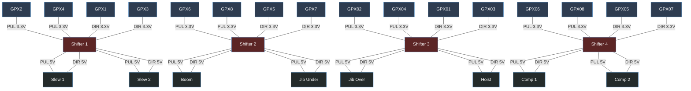
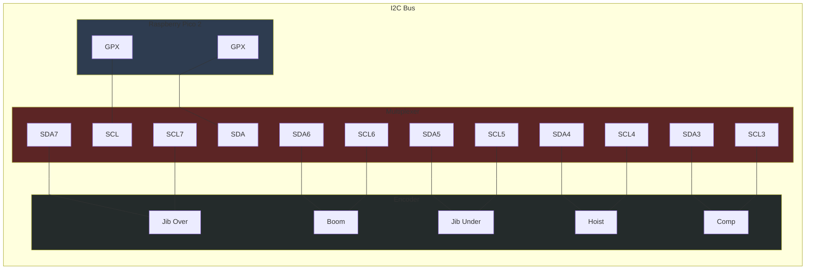
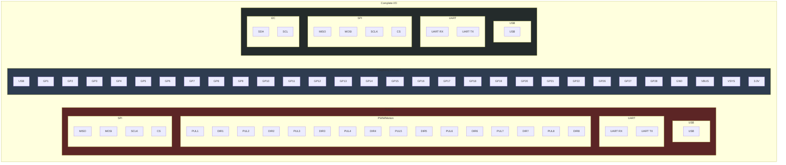
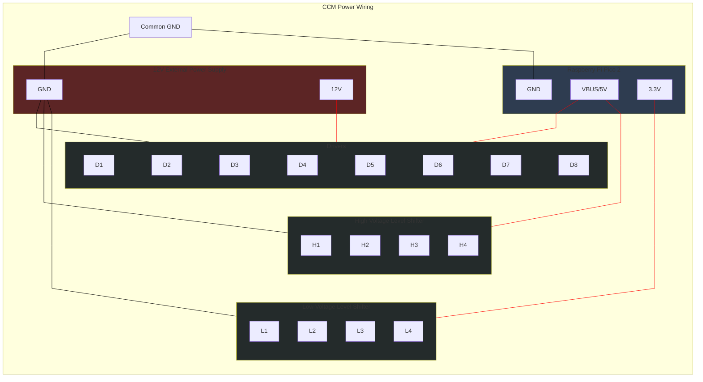
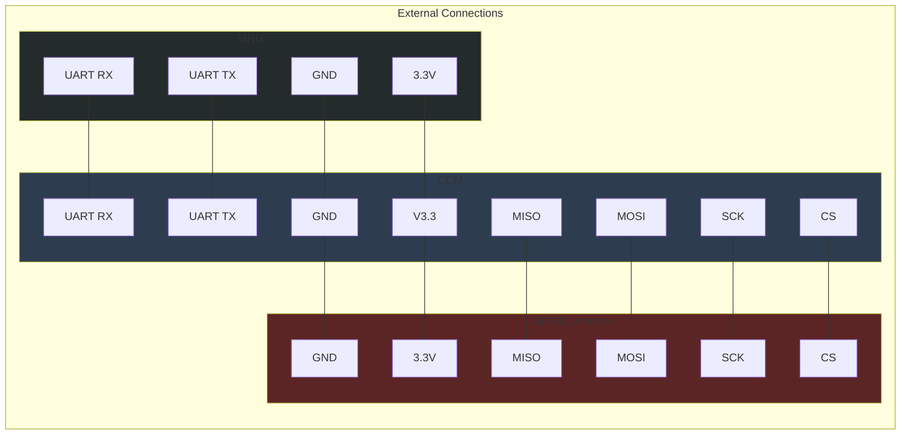

# scale-crane-electric-wire-luffing

---

## CCM Motor Driver Logic

```mermaid
%%{init: {'flowchart': {'curve': 'linear'}}}%%
flowchart TB

    classDef pico fill:#2e3c50,stroke:#5b9bd5,color:#fff
    classDef shifter fill:#5c2525,stroke:#5b9bd5,color:#fff
    classDef driver fill:#242b2b,stroke:#5b9bd5,color:#fff

    DM1[Slew 1]:::driver
    DM2[Slew 2]:::driver
    DM3[Boom]:::driver
    DM4[Jib Under]:::driver
    DM5[Jib Over]:::driver
    DM6[Hoist]:::driver
    DM7[Comp 1]:::driver
    DM8[Comp 2]:::driver

    LLS1[Shifter 1]:::shifter
    LLS2[Shifter 2]:::shifter
    LLS3[Shifter 3]:::shifter
    LLS4[Shifter 4]:::shifter

    GPX1:::pico
    GPX2:::pico
    GPX3:::pico
    GPX4:::pico
    GPX5:::pico
    GPX6:::pico
    GPX7:::pico
    GPX8:::pico
    GPX01:::pico
    GPX02:::pico
    GPX03:::pico
    GPX04:::pico
    GPX05:::pico
    GPX06:::pico
    GPX07:::pico
    GPX08:::pico

%%linkStyle 0,1 display:none
GPX2 ---|PUL 3.3V| LLS1 ---|PUL 5V| DM1
GPX4 ---|PUL 3.3V| LLS1 ---|PUL 5V| DM2

GPX6 ---|PUL 3.3V| LLS2 ---|PUL 5V| DM3
GPX8 ---|PUL 3.3V| LLS2 ---|PUL 5V| DM4

GPX02 ---|PUL 3.3V| LLS3 ---|PUL 5V| DM5
GPX04 ---|PUL 3.3V| LLS3 ---|PUL 5V| DM6

GPX06 ---|PUL 3.3V| LLS4 ---|PUL 5V| DM7
GPX08 ---|PUL 3.3V| LLS4 ---|PUL 5V| DM8


GPX1 ---|DIR 3.3V| LLS1 ---|DIR 5V| DM1
GPX3 ---|DIR 3.3V| LLS1 ---|DIR 5V| DM2

GPX5 ---|DIR 3.3V| LLS2 ---|DIR 5V| DM3
GPX7 ---|DIR 3.3V| LLS2 ---|DIR 5V| DM4

GPX01 ---|DIR 3.3V| LLS3 ---|DIR 5V| DM5
GPX03 ---|DIR 3.3V| LLS3 ---|DIR 5V| DM6

GPX05 ---|DIR 3.3V| LLS4 ---|DIR 5V| DM7
GPX07 ---|DIR 3.3V| LLS4 ---|DIR 5V| DM8

```

---

## CCM Pico I2C BUS

```mermaid
%%{init: {'flowchart': {'curve': 'linear'}}}%%

flowchart LR


subgraph I2C[I2C Bus]
    direction TB

    PICO
    MPX
    ENC
end

subgraph PICO[Raspberry Pico 2]
    direction TB

    SDA[GPX]
    SCL[GPX]
    %%V[3.3V]
    %%GND
end


subgraph MPX[Multiplexer]
    direction TB

    MP_1[SDA]
    MP_2[SCL]
    %%V1[3.3V]
    %%GND1[GND]
    SDA7
    SCL7
    SDA6
    SCL6
    SDA5
    SCL5
    SDA4
    SCL4
    SDA3
    SCL3

end


subgraph ENC[Encoder]
    direction TB

    ENC1[Jib Over]
    ENC2[Boom]
    ENC3[Jib Under]
    ENC4[Hoist]
    ENC5[Comp]
end

PICO --- MPX --- ENC
linkStyle 0,1 display:none

%% FORMATTING
    %%MT1[" "]
    %%MT2[" "]
    %%style MT1 display:none,stroke:none
    %%style MT2 display:none,stroke:none

    %%PICO --- MT1 --- MPX --- MT2 --- ENC
    %%linkStyle 0,1,2,3 display:none

%% PICO TO MULTIPLEXER
SDA --- MP_1
SCL --- MP_2
%%V --- V1
%%GND --- GND1

%% MULTIPLEXER TO ENCODERS
SDA7 & SCL7 --- ENC1
SDA6 & SCL6 --- ENC2
SDA5 & SCL5 --- ENC3
SDA4 & SCL4 --- ENC4
SDA3 & SCL3 --- ENC5

%% Power to all enc
    %%V1 --- ENC1 & ENC2 & ENC3 & ENC4 & ENC5
    %%GND1 --- ENC1 & ENC2 & ENC3 & ENC4 & ENC5


%% STYLE FILL
style PICO fill:#2e3c50
style ENC fill:#242b2b
style MPX fill:#5c2525
```

---

## CCM Pico Complete I/O

```mermaid
%%{init: {'flowchart': {'curve': 'linear'}}}%%
flowchart TB

subgraph IO[Complete I/O]
    direction TB

    IN
    PICO
    OUT
end

subgraph PICO[Raspberry Pi Pico 2]
    direction TB

    USB
    GP1
    GP2
    GP3
    GP4
    GP5
    GP6
    GP7
    GP8
    GP9
    GP10
    GP11
    GP12
    GP13
    GP14
    GP15
    GP16
    GP17
    GP18
    GP19
    GP20
    GP21
    GP22
    GP26
    GP27
    GP28
    GND
    VBUS
    VSYS
    V33[3.3V]
end

subgraph IN[Input]
    direction TB

    subgraph USB_I[USB]
        USB0[USB]
    end

    subgraph U_IN[UART]
        direction TB

        RXI[UART RX]
        TXI[UART TX]
    end

    subgraph SPI_I[SPI]
        direction TB
        MISO
        MOSI
        SCLK
        CS
    end

     subgraph I2C_OUT[I2C]
        direction TB
        SDA
        SCL
    end
end

subgraph OUT[Output]
    direction TB

    subgraph USB_OUT[USB]
        USB1[USB]
    end

    subgraph U_OUT[UART]
        direction TB

        RXO[UART RX]
        TXO[UART TX]
    end

    subgraph ST[PWM/Motion]
    direction TB

        PUL1
        DIR1
        PUL2
        DIR2
        PUL3
        DIR3
        PUL4
        DIR4
        PUL5
        DIR5
        PUL6
        DIR6
        PUL7
        DIR7
        PUL8
        DIR8
    end

    subgraph I2C_OUT[I2C]
        direction TB
        SDA
        SCL
    end

    subgraph SPI_O[SPI]
        direction TB
        MISO_O[MISO]
        MOSI_O[MOSI]
        SCLK_O[SCLK]
        CS_O[CS]
    end

end

%% Connect
IN --- PICO --- OUT
linkStyle 0,1 display:none


%% Style
style PICO fill:#2e3c50
style IN fill:#242b2b
style OUT fill:#5c2525
```

---

## CCM Power Wiring

```mermaid
%%{init: {'flowchart': {'curve': 'linear'}}}%%
flowchart TB


subgraph DP[CCM Power Wiring]
    direction TB
    GND_C
    PSU
    DRIVER
    PICO
    HVLLS
    LVLLS
end


subgraph PSU[12V External Power Supply]
    direction TB
    12V
    GND
end


subgraph DRIVER[Drivers]
    direction LR
    D1
    D2
    D3
    D4
    D5
    D6
    D7
    D8
end


subgraph PICO[Raspberry Pi Pico 2]
    direction TB
    V33[3.3V]
    VBUS[VBUS/5V]
    GND0[GND]
end

subgraph HVLLS[High Voltage Level Shifter]
    direction TB
    H1
    H2
    H3
    H4
end

subgraph LVLLS[Low Voltage Level Shifter]
    direction TB
    L1
    L2
    L3
    L4
end

GND_C["Common GND"]
V5_COM[" "]
style V5_COM display:none

GND_C --- GND
GND_C --- GND0


D1 --- D2 --- D3 --- D4 --- D5 --- D6 --- D7 --- D8
12V & GND --- DRIVER

DRIVER --- HVLLS --- LVLLS
VBUS --- DRIVER
VBUS --- HVLLS
V33 --- LVLLS
GND --- HVLLS
GND --- LVLLS

%% Style
linkStyle 2,3,4,5,6,7,8,11,12 display:none
linkStyle 0,1,10,16,17 stroke:#000000
linkStyle default stroke:#ff0000
style PICO fill:#2e3c50
style DRIVER fill:#242b2b
style HVLLS fill:#242b2b
style LVLLS fill:#242b2b
style PSU fill:#5c2525
```

---

## External Connections

```mermaid
%%{init: {'flowchart': {'curve': 'linear'}}}%%
flowchart LR


subgraph CCM
    TX[UART TX]
    RX[UART RX]
    MISO
    MOSI
    SCK
    CS
    GND
    V3[V3.3]
end


subgraph SPI[SPI RC Antenna]
    MISO_O[MISO]
    MOSI_O[MOSI]
    SCK_O[SCK]
    CS_O[CS]
    GND0[GND]
    V30[3.3V]
end

subgraph MRU[MRU]
    RX0[UART RX]
    TX0[UART TX]
    GND1[GND]
    V31[3.3V]
end

subgraph External Connections
    MRU    
    CCM
    SPI 
end


RX0 --- RX
TX0 --- TX
GND1 --- GND --- GND0
V31 --- V3 --- V30
MISO --- MISO_O
MOSI --- MOSI_O
SCK --- SCK_O
CS --- CS_O


style CCM fill:#2e3c50
style MRU fill:#242b2b
style SPI fill:#5c2525

```
