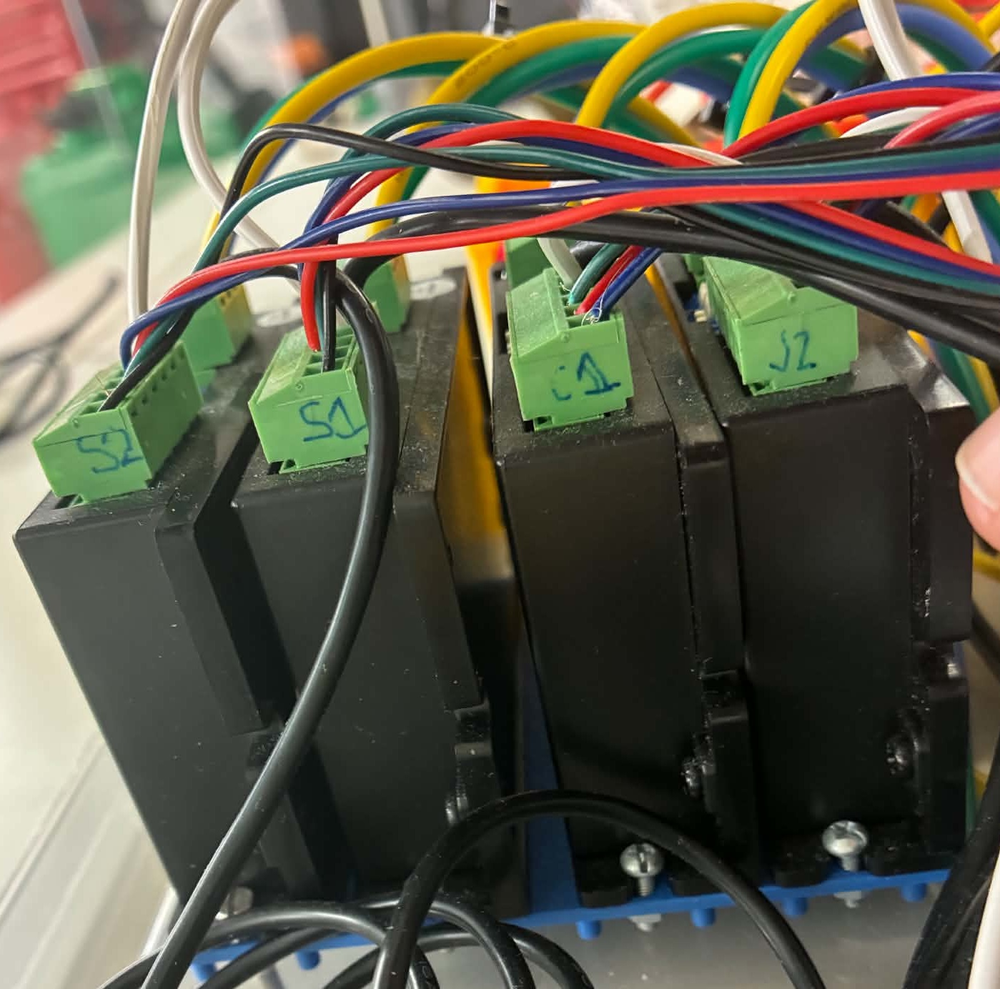
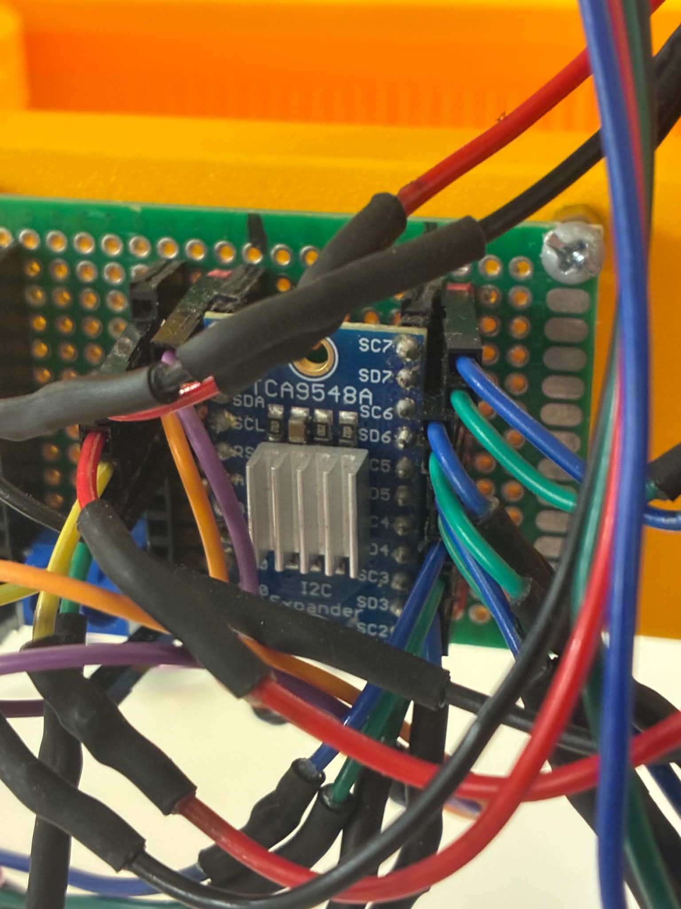
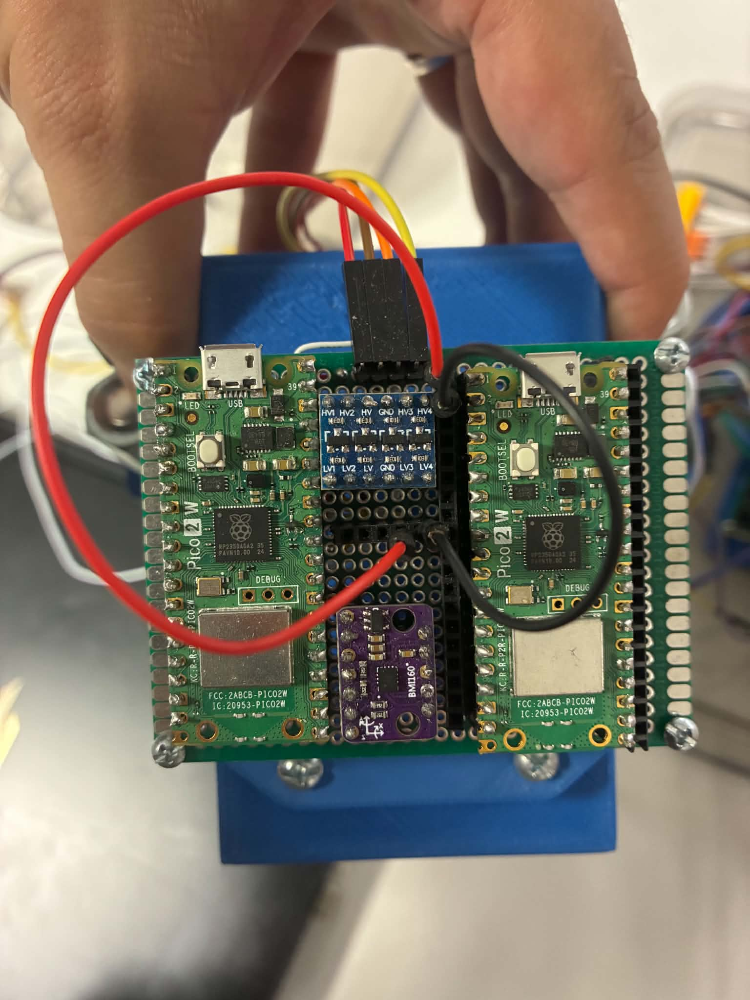
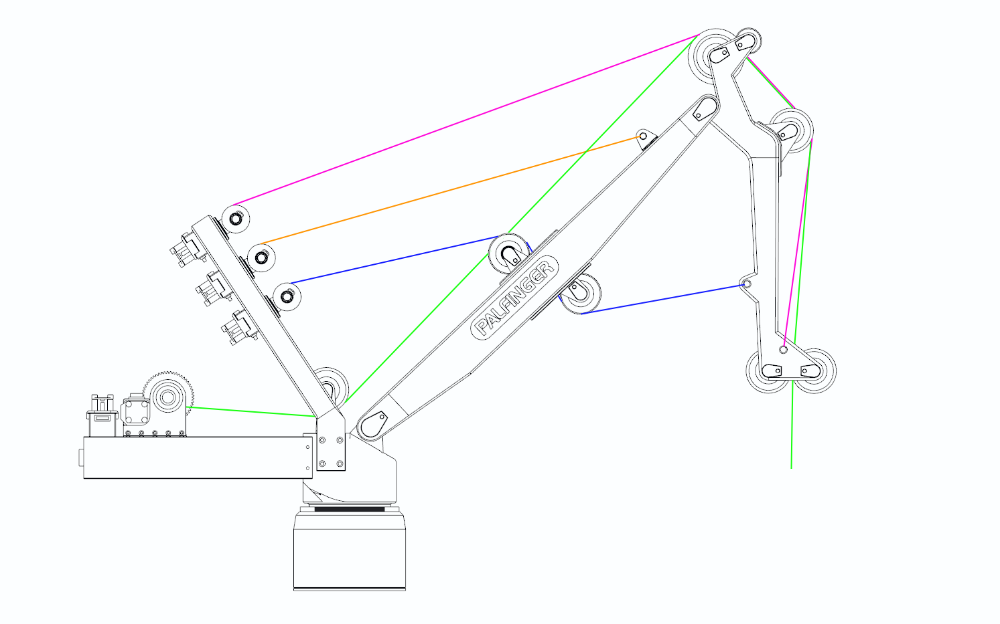

# Rigging Guide
[Back](../README.md)


## Setup
 1. Mount Crane to Stewart Platform using 6pcs M6 screws and nuts
 ---
 2. Connect Stewart Platform leg connectors to main board<br>

 *Graphical Representation in [Platform Wiring/Commisioning](/Wiring%20Schematics/PLATFORM_wiring.md)*
 
 ---
 3. Connect Motor Wiring from Crane to CCM<br>
 Match Colors and Names (W ,C1 ,C2 ,B ,J1 ,J2 ,S1 ,S2 )

 

 4. Connect I2C from Multiplexer (Rats nest on side of compensator)<br>
 Four wires; 2 jumper cables (white,grey), 2 one-sided jumpers with 16AWG ends (green)
 White,Grey are SDA/SCL lines for I2C, 16AWG wires are powersupply for multiplexer

 

 5. Connect UART Jumpers to CCM and MRU<br>
 Four wires; 4 jumper cables (blue,yellow,red,black)<br>



 *Graphical Representation in [System Wiring/Commisioning](/Wiring%20Schematics/SYSTEM_wiring.md)*
 
 ---

 6. Connect 12V Supply to both CCM and Platform Mainboard (Both boards should also be able to handle 24V, which will increase effective motor torque at speed)

 ---

 7. If controlling platform via Server, configure WiFi credentials through Thonny IDE while plugged into the Stewart Platform mainboard.
 This will also require configuring the WiFi credentials on the Server Module in the same way.

 ---

 8. Perform a simple connection check on the remote control

   - With the CCM unpowered, flick the power switch on the controller
   - Screen should read ```NLINK``` and signal indicators should blink red/green
   - Turn off remote
   - Then with the CCM **powered**, flick the power switch on the controller
   - Screen should read ```int dBm``` and signal indicators should be stable
   - If not, the remote is unable to communicate with the CCM <br>(Try flicking the antenna of the CCM and turning off and on again) <br> Should this not work, plug into the controller with Thonny IDE and read the debug REPL<br>Antenna ID should be ```0x14```
9. If the connection was successful, Crane should be ready to operate

## Wire Spooling

To ensure proper operation and response of the crane the luffing wires must spool correctly, at this scale it is especially difficult to keep the wire correctly spooled. Should the wire not have spooled correctly consider these options.
 <br>**Operating relevant winches with crane powered on**<br>
 **Unspooling/Respooling by hand with no power connected**

    - Unspool all wire on winch drum
    - With moderate tension (a respectable pinch) respool the drum
    - Push/Correct spooling as necessary underway

It is recommended to check all 7 Winches<br>
(Although the main winch does not care much for correct spooling)

*Reference Wire routing*



## Server Setup