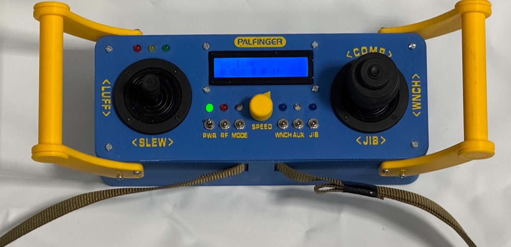
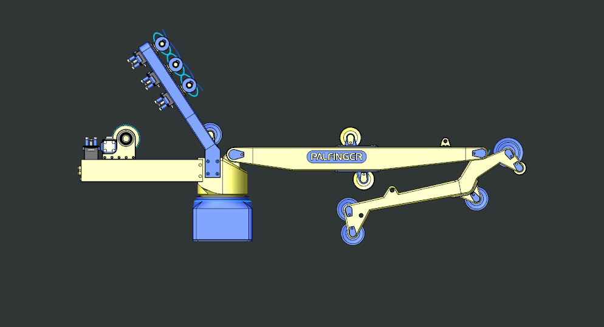

# How to Operate  

## Remote Control

Joystick ``<SLEW>`` : Slews crane (Rotating the entire base)

Joystick ``<LUFF>`` : Operates boom (First link of crane up/down)

Joystick ``<JIB>`` : Operates jib (Second link of crane in/out)

Joystick ``<COMP>`` : Runs Compensator 'Cartridge' (Rear rail in/out)

Joystick ``<WNCH>`` : Main winch hoist (Load up/down)

Switch ``PWR`` : Power switch (Internal 9V battery)

Switch ``RF``: Encoder reset switch. Use ONLY when resetting encoders with crane in folded configuration.

Switch ``MODE``: Activate Heave Compensation.

Switch ``WNCH``: Debug Switch for reading error messages in Thonny IDE while connected to CCM

Switch ``AUX``: Unmapped

Switch ``JIB``: Switches operation mode of Jib Winches.

-``Off``: Synchronous (Both winches running)

-``On``: Only bottom wire

Knob ``Speed``:

-``button press`` : Enter menu

-``rotation`` : Adjust speed limit of each link

-``repeat button press``: Next entry in menu

## Encoder reset sequence

1. Ensure proper spooling on all winches, and run the crane to folded position.

2. Double check that all winches are tensioned at folded position.

3. Flick Switch ``RF`` On for 3 seconds, then off again.

4. Crane is now ready for operation, and Active Heave Compenstation

[Back](../README.md)
