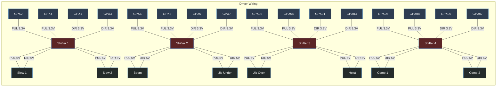
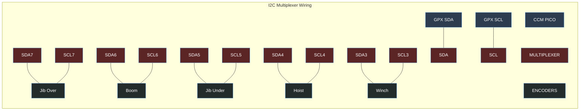
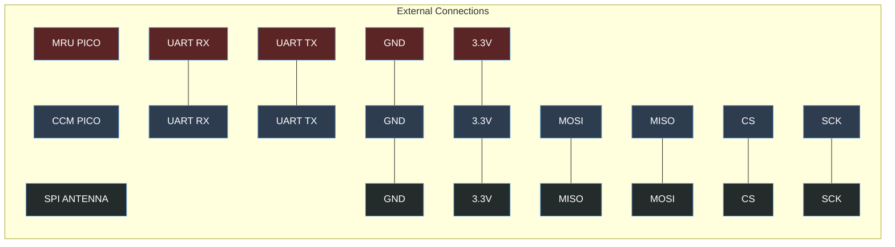
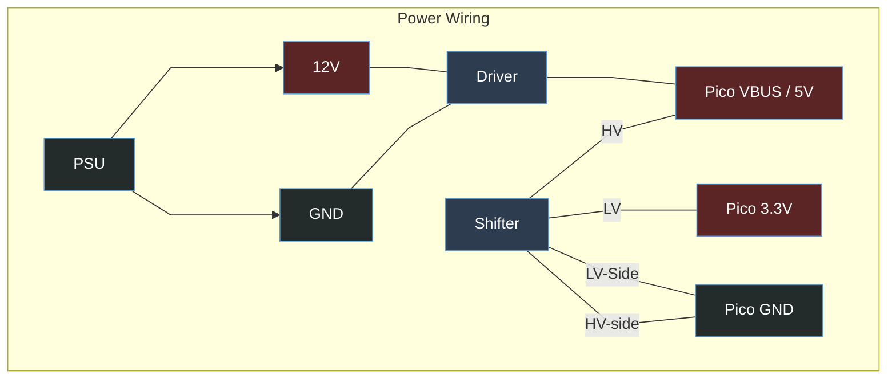

# Crane Control Module Wiring Diagrams
[Back](../README.md)
## External Communication / I2C Bus / Driver Wiring

```mermaid
%%{init: {'flowchart': {'curve': 'linear'}}}%%
flowchart LR
classDef style2 fill:#2e3c50,stroke:#5b9bd5,color:#fff
classDef style1 fill:#5c2525,stroke:#5b9bd5,color:#fff
classDef style3 fill:#242b2b,stroke:#5b9bd5,color:#fff
subgraph Driver Wiring
    direction TD

    DM1[Slew 1]:::style3
    DM2[Slew 2]:::style3
    DM3[Boom]:::style3
    DM4[Jib Under]:::style3
    DM5[Jib Over]:::style3
    DM6[Hoist]:::style3
    DM7[Comp 1]:::style3
    DM8[Comp 2]:::style3

    LLS1[Shifter 1]:::style1
    LLS2[Shifter 2]:::style1
    LLS3[Shifter 3]:::style1
    LLS4[Shifter 4]:::style1

    GPX1:::style2
    GPX2:::style2
    GPX3:::style2
    GPX4:::style2
    GPX5:::style2
    GPX6:::style2
    GPX7:::style2
    GPX8:::style2
    GPX01:::style2
    GPX02:::style2
    GPX03:::style2
    GPX04:::style2
    GPX05:::style2
    GPX06:::style2
    GPX07:::style2
    GPX08:::style2

%%linkStyle 0,1 display:none
GPX2 ---|PUL 3.3V| LLS1 ---|PUL 5V| DM1
GPX4 ---|PUL 3.3V| LLS1 ---|PUL 5V| DM2

GPX6 ---|PUL 3.3V| LLS2 ---|PUL 5V| DM3
GPX8 ---|PUL 3.3V| LLS2 ---|PUL 5V| DM4

GPX02 ---|PUL 3.3V| LLS3 ---|PUL 5V| DM5
GPX04 ---|PUL 3.3V| LLS3 ---|PUL 5V| DM6

GPX06 ---|PUL 3.3V| LLS4 ---|PUL 5V| DM7
GPX08 ---|PUL 3.3V| LLS4 ---|PUL 5V| DM8


GPX1 ---|DIR 3.3V| LLS1 ---|DIR 5V| DM1
GPX3 ---|DIR 3.3V| LLS1 ---|DIR 5V| DM2

GPX5 ---|DIR 3.3V| LLS2 ---|DIR 5V| DM3
GPX7 ---|DIR 3.3V| LLS2 ---|DIR 5V| DM4

GPX01 ---|DIR 3.3V| LLS3 ---|DIR 5V| DM5
GPX03 ---|DIR 3.3V| LLS3 ---|DIR 5V| DM6

GPX05 ---|DIR 3.3V| LLS4 ---|DIR 5V| DM7
GPX07 ---|DIR 3.3V| LLS4 ---|DIR 5V| DM8
end
```

```mermaid
flowchart LR
classDef style2 fill:#2e3c50,stroke:#5b9bd5,color:#fff
    classDef style1 fill:#5c2525,stroke:#5b9bd5,color:#fff
    classDef style3 fill:#242b2b,stroke:#5b9bd5,color:#fff
subgraph I2C Multiplexer Wiring
    GP1[GPX SDA]:::style2
    GP2[GPX SCL]:::style2

    MPXSD[SDA]:::style1
    MPXSC[SCL]:::style1
    SDA7:::style1
    SCL7:::style1
    SDA6:::style1
    SCL6:::style1
    SDA5:::style1
    SCL5:::style1
    SDA4:::style1
    SCL4:::style1
    SDA3:::style1
    SCL3:::style1

    ENC1[Jib Over]:::style3
    ENC2[Boom]:::style3
    ENC3[Jib Under]:::style3
    ENC4[Hoist]:::style3
    ENC5[Winch]:::style3

    X991[" "]
    style X991 display:none

GP1 --- MPXSD
GP2 --- MPXSC
SDA7 & SCL7 --- ENC1
SDA6 & SCL6 --- ENC2
SDA5 & SCL5 --- ENC3
SDA4 & SCL4 --- ENC4
SDA3 & SCL3 --- ENC5
MPXSD & MPXSC --- X991
SP1[CCM PICO]:::style2 --- SP2[MULTIPLEXER]:::style1 --- SP3[ENCODERS]:::style3
linkStyle 12,13,14,15 display:none


end
```

```mermaid
flowchart LR
    classDef style2 fill:#2e3c50,stroke:#5b9bd5,color:#fff
    classDef style1 fill:#5c2525,stroke:#5b9bd5,color:#fff
    classDef style3 fill:#242b2b,stroke:#5b9bd5,color:#fff  
subgraph External Connections
URX0[UART RX]:::style1
UTX0[UART TX]:::style1
GN0[GND]:::style1
V0[3.3V]:::style1

URX1[UART RX]:::style2
UTX1[UART TX]:::style2
GN1[GND]:::style2
V1[3.3V]:::style2
MISO0[MISO]:::style2
MOSI0[MOSI]:::style2
SCK0[SCK]:::style2
CS0[CS]:::style2

X192[" "]
style X192 display:none

GN2[GND]:::style3
V2[3.3V]:::style3
MOSI1[MOSI]:::style3
MISO1[MISO]:::style3
SCK1[SCK]:::style3
CS1[CS]:::style3

FFG2["CCM PICO"]:::style2 --- FFG3[SPI ANTENNA]:::style3
URX0 --- URX1 --- X192
UTX0 --- UTX1 --- X192
FFG1["MRU PICO"]:::style1 --- FFG2
linkStyle 0,2,4,5 display:none
GN0 --- GN1 --- GN2
V0 --- V1 --- V2
MOSI0 --- MISO1
MISO0 --- MOSI1
CS0 --- CS1
SCK0 --- SCK1

end
```
## Power Wiring CCM

```mermaid
%%{init: {'flowchart': {'curve': 'linear'}}}%%
flowchart TB

    classDef style2 fill:#2e3c50,stroke:#5b9bd5,color:#fff
    classDef style1 fill:#5c2525,stroke:#5b9bd5,color:#fff
    classDef style3 fill:#242b2b,stroke:#5b9bd5,color:#fff

subgraph Power Wiring
PSU:::style3
GND:::style3
12V:::style1
Driver:::style2
P5[Pico VBUS / 5V]:::style1
P3[Pico 3.3V]:::style1
LSH[Shifter]:::style2
PG[Pico GND]:::style3 


PSU ---> 12V --- Driver --- P5
GND --- LSH ---|LV| P3
linkStyle 3 display:none
GND --- Driver
PG ---|HV-side| LSH ---|HV| P5
LSH ---|LV-Side| PG

PSU ---> GND
end
```

## Absolute CCM Pico I/O Wiring

```mermaid
%%{init: {'flowchart': {'curve': 'linear'}}}%%
flowchart TB

    classDef style2 fill:#2e3c50,stroke:#5b9bd5,color:#fff
    classDef style1 fill:#5c2525,stroke:#5b9bd5,color:#fff
    classDef style3 fill:#242b2b,stroke:#5b9bd5,color:#fff

subgraph Absolute I/O

    CCM[CCM PICO]:::style1
    INPUT[Input]:::style3
    OUTPUT[Output]:::style2

    X290[" "]
    style X290 display:none

    USB["USB"]:::style1
    GP0:::style1
    GP1:::style1
    GP2:::style1
    GP3:::style1
    GP4:::style1
    GP5:::style1
    GP6:::style1
    GP7:::style1
    GP8:::style1
    GP9:::style1
    GP10:::style1
    GP11:::style1
    GP12:::style1
    GP13:::style1
    GP14:::style1
    GP15:::style1
    GP16:::style1
    GP17:::style1
    GP18:::style1
    GP19:::style1
    GP20:::style1
    GP21:::style1
    GP22:::style1
    GP26:::style1
    GP27:::style1
    GP28:::style1

    USBI[USB]:::style3

    TX[UART TX]:::style3
    RX[UART RX]:::style3

    MISO:::style3
    MOSI:::style3
    SCK:::style3
    CS:::style3

    TXU[UART TX]:::style2
    RXU[UART TX]:::style2

    MOSIU[MOSI]:::style2
    MISOU[MISO]:::style2
    SCKU[SCK]:::style2
    CSU[CS]:::style2

    PUL1:::style2
    PUL2:::style2
    PUL3:::style2
    PUL4:::style2
    PUL5:::style2
    PUL6:::style2
    PUL7:::style2
    PUL8:::style2

    DIR1:::style2
    DIR2:::style2
    DIR3:::style2
    DIR4:::style2
    DIR5:::style2
    DIR6:::style2
    DIR7:::style2
    DIR8:::style2

INPUT --- CCM --- OUTPUT
linkStyle 0,1 display:none
USBI --- USB --- X290
linkStyle 3 display:none
TX --- GP0 --- TXU
RX --- GP1 --- RXU


end
```
