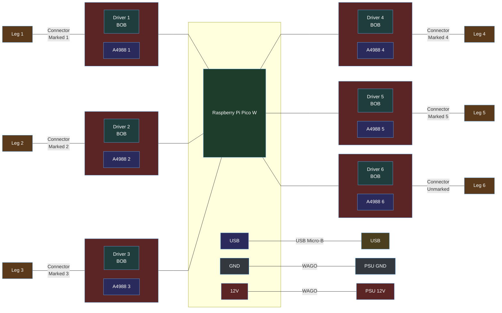
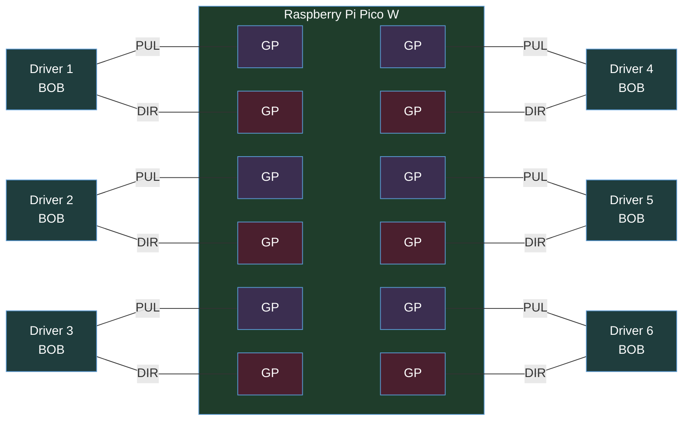

# Stewart Platform <br>Wiring Schematics
[Back](../README.md)


## Commisioning/Decommisioning

<br>
<br>
<br>

## Platform GPIO Wiring
*(Note: Please add GPIO numbering)*

<br>
<br>
<br>

## Platform Power Wiring
```mermaid
%%{init: { 'flowchart': { 'nodeSpacing': 30, 'rankSpacing': 100, 'curve': 'linear' } } }%%
flowchart TB
classDef navy fill:#2e3c50,stroke:#5b9bd5,color:#fff
classDef crimson fill:#5c2525,stroke:#5b9bd5,color:#fff
classDef forest fill:#1f3d2b,stroke:#5b9bd5,color:#fff
classDef plum fill:#3b2e50,stroke:#5b9bd5,color:#fff
classDef teal fill:#1f3d3d,stroke:#5b9bd5,color:#fff
classDef amber fill:#5a3a1a,stroke:#5b9bd5,color:#fff
classDef magenta fill:#4a1f3d,stroke:#5b9bd5,color:#fff
classDef olive fill:#4a4a1f,stroke:#5b9bd5,color:#fff
classDef slate fill:#33383f,stroke:#5b9bd5,color:#fff
classDef indigo fill:#2a2a5c,stroke:#5b9bd5,color:#fff
classDef maroon fill:#4a1f2e,stroke:#5b9bd5,color:#fff
classDef umber fill:#3d2b1f,stroke:#5b9bd5,color:#fff
classDef steel fill:#1f3a4a,stroke:#5b9bd5,color:#fff
classDef mustard fill:#4a3f1f,stroke:#5b9bd5,color:#fff

D1[Driver 1<br> BOB]
D2[Driver 2<br> BOB]
D3[Driver 3<br> BOB]
D4[Driver 4<br> BOB]
D5[Driver 5<br> BOB]
D6[Driver 6<br> BOB]


subgraph PSU
    GND[Common GND]
    12V
end

subgraph DRV[" "]
    D1
    D2
    D3
    D4
    D5
    D6
end

subgraph RB["Raspberry Pi Pico W"]
    VBUS[VBUS<br>5V]
    USB
    3.3V
    GN[GND]
end


GND ---|To all BOB| D1 & D4 %%0,1
12V ---|To all BOB| D1 & D4 %%2,3
D3 & D6 ---|To all BOB| VBUS %%4,5
GND --- GN %%6

linkStyle 0,1,6 stroke:#2A2A2A,stroke-width:5px
linkStyle 2,3,4,5 stroke:#FF4D4D,stroke-width:4px
USB --- USB0["USB"]
linkStyle 7 stroke:#4a4,stroke-width:6px

D1 --- D2 --- D3
D4 --- D5 --- D6


%%style
12V:::crimson
VBUS:::crimson
GND:::slate
GN:::slate
RB:::forest
USB:::indigo
USB0:::mustard
3.3V:::crimson
PSU:::navy
DRV:::steel
D1:::teal
D2:::teal
D3:::teal
D4:::teal
D5:::teal
D6:::teal
```