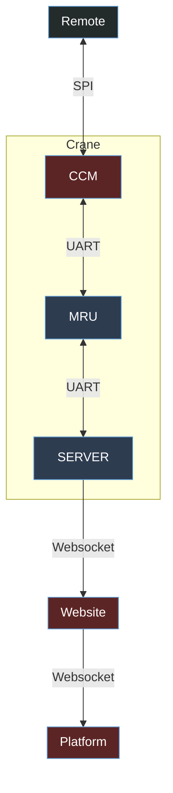
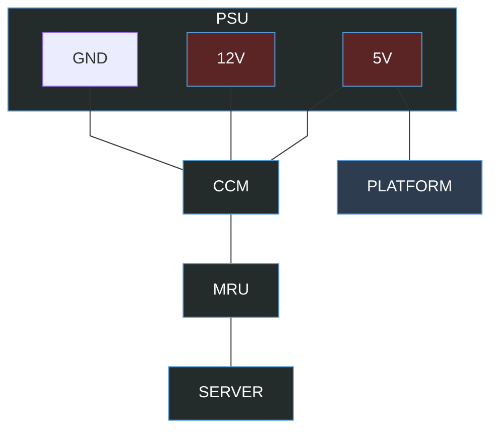
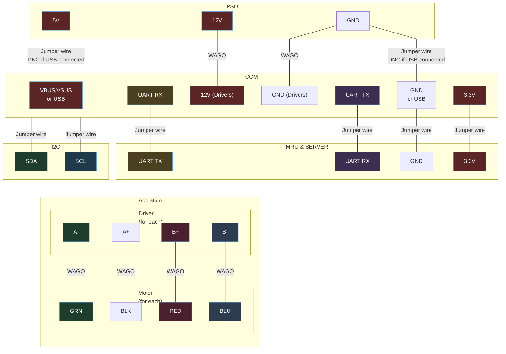

# System Architechure and intermodular wiring schematic

## Intermodular Connections

```mermaid
%%{init: {'flowchart': {'curve': 'linear'}}}%%
flowchart TB
    classDef style2 fill:#2e3c50,stroke:#5b9bd5,color:#fff
    classDef style1 fill:#5c2525,stroke:#5b9bd5,color:#fff
    classDef style3 fill:#242b2b,stroke:#5b9bd5,color:#fff


subgraph Remote
end

subgraph Crane
 direction LR
    CCM
    MRU
    SERVER
end

subgraph Website
end

subgraph Platform
end


CCM <--->|UART| MRU <--->|UART| SERVER

Remote <--->|SPI| CCM
SERVER --->|Websocket| Website
Website --->|Websocket| Platform

%%style
Remote:::style3
Crane:::default
CCM:::style1
MRU:::style2
SERVER:::style2
Website:::style1
Platform:::style1
```
---
## System Power Wiring

```mermaid
%%{init: {'flowchart': {'curve': 'linear'}}}%%
flowchart TB
    classDef style2 fill:#2e3c50,stroke:#5b9bd5,color:#fff
    classDef style1 fill:#5c2525,stroke:#5b9bd5,color:#fff
    classDef style3 fill:#242b2b,stroke:#5b9bd5,color:#fff

subgraph PSU
    GND
    12V:::style1
    5V:::style1
end
PSU:::style3
CCM:::style3
MRU:::style3
SERVER:::style3

PLATFORM:::style2

GND & 12V & 5V --- CCM
5V --- PLATFORM
CCM --- MRU --- SERVER
```

## Wiring for commissioning/decom

```mermaid
%%{init: {'flowchart': {'curve': 'linear'}}}%%
flowchart TB
classDef navy fill:#2e3c50,stroke:#5b9bd5,color:#fff
classDef crimson fill:#5c2525,stroke:#5b9bd5,color:#fff
classDef forest fill:#1f3d2b,stroke:#5b9bd5,color:#fff
classDef plum fill:#3b2e50,stroke:#5b9bd5,color:#fff
classDef teal fill:#1f3d3d,stroke:#5b9bd5,color:#fff
classDef amber fill:#5a3a1a,stroke:#5b9bd5,color:#fff
classDef magenta fill:#4a1f3d,stroke:#5b9bd5,color:#fff
classDef olive fill:#4a4a1f,stroke:#5b9bd5,color:#fff
classDef slate fill:#33383f,stroke:#5b9bd5,color:#fff
classDef indigo fill:#2a2a5c,stroke:#5b9bd5,color:#fff
classDef maroon fill:#4a1f2e,stroke:#5b9bd5,color:#fff
classDef umber fill:#3d2b1f,stroke:#5b9bd5,color:#fff
classDef steel fill:#1f3a4a,stroke:#5b9bd5,color:#fff
classDef mustard fill:#4a3f1f,stroke:#5b9bd5,color:#fff

subgraph PSU
    GND
    12V:::style1
    5V:::style1
end

subgraph CCM
    V5[VBUS/VSUS<br> or USB]:::style1
    GN[GND<br>or USB]
    V12["12V (Drivers)"]:::style1
    GN12["GND (Drivers)"]
    TX[UART TX]
    RX[UART RX]
    V3[3.3V]:::style1
end

subgraph MRU[MRU & SERVER]
    TX1[UART TX]
    RX1[UART RX]
    GNM[GND]
    V31[3.3V]:::style1
end

subgraph I2C
    SDA
    SCL
end

subgraph DR["Driver<br>(for each)"]
    A+
    A-
    B+
    B-
end

subgraph MT["Motor<br>(for each)"]
    GRN
    BLK
    RED
    BLU
end

subgraph Actuation
    direction TB
    DR
    MT
end
GND ---|Jumper wire<br>DNC if USB connected| GN
GND ---|WAGO| GN12
5V ---|Jumper wire<br>DNC if USB connected| V5
CCM ---|Jumper wire| SDA & SCL
12V ---|WAGO| V12


A+ ---|WAGO| BLK
A- ---|WAGO| GRN
B+ ---|WAGO| RED
B- ---|WAGO| BLU

TX ---|Jumper wire| RX1
RX ---|Jumper wire| TX1
V3 ---|Jumper wire| V31
GN ---|Jumper wire| GNM

MRU --- Actuation
linkStyle 14 display:none


%%style
PSU:::default
5V:::crimson
12V:::crimson
V3:::crimson
V31:::crimson
RX:::mustard
TX1:::mustard
TX:::plum
RX1:::plum
V12:::crimson
V5:::crimson
RED:::maroon
B+:::maroon
A-:::forest
GRN:::forest
BLU:::navy
B-:::navy
SDA:::forest
SCL:::steel

```